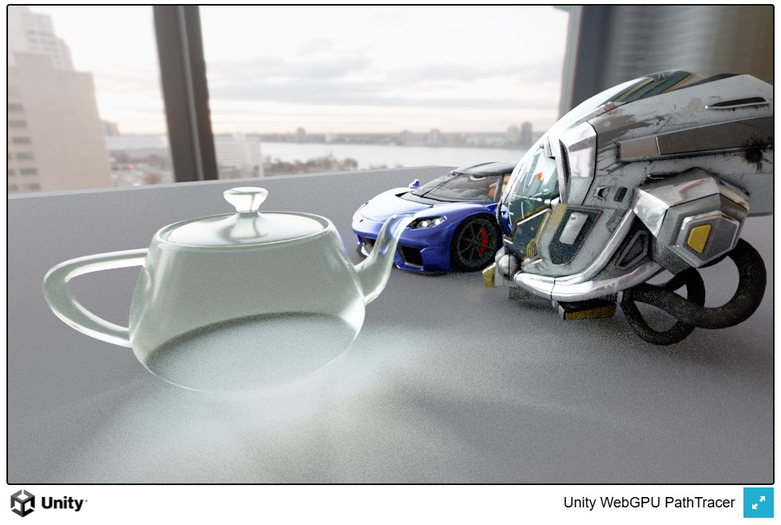

## Untiy WebGPU Path Tracer

Yet another path tracer.

This one is built on top of Unity specifically targetting WebgGPU.
Path tracer is implemented in a compute shader.

This is a work in progress, it has issues and needs a lot of cleanup. I have a lot of
ideas for it, and will get back to it at some point.

### References

Code for this project has been inspired by, or copied directly from the following:

* https://github.com/jbikker/tinybvh
* https://github.com/andr3wmac/unity-tinybvh
* https://github.com/lisyarus/webgpu-raytracer
* https://github.com/gnikoloff/webgpu-raytracer
* https://github.com/Nelarius/rayfinder
* https://github.com/knightcrawler25/GLSL-PathTracer
* https://raytracing.github.io
* https://pbrt.org

----

